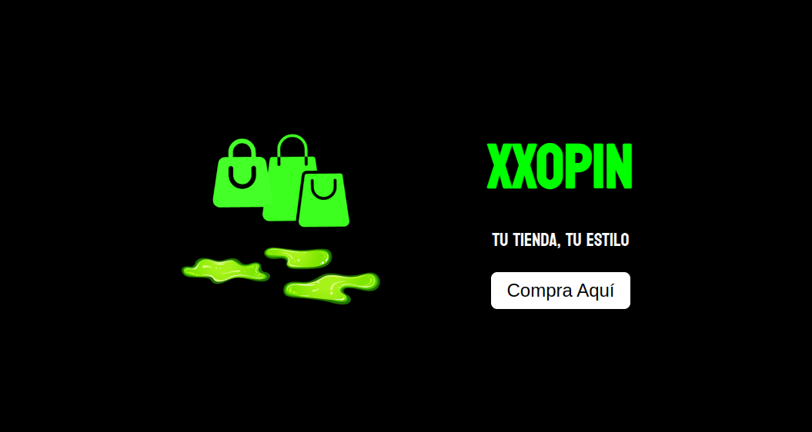
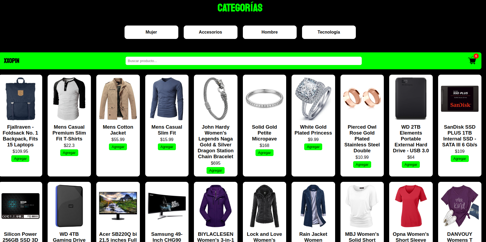
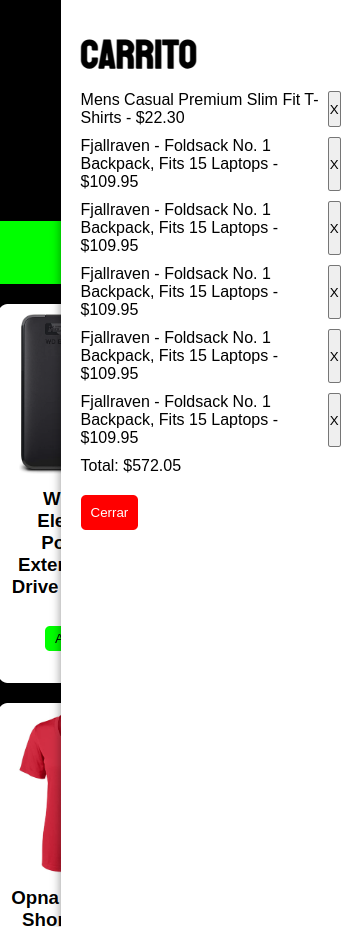

# proyecto_js

## XXOPIN 🛍️

**Aplicación web Front‑End** que consume la API pública [Fake Store API](https://fakestoreapi.com/products) para mostrar productos organizados por categoría, permitiendo filtrado, ordenamiento y gestión de carrito de compras con una interfaz moderna, dinámica y responsiva.

---

## 📖 Descripción

XXOPIN es una SPA Front‑End desarrollada con HTML, CSS y JavaScript puro. Permite al usuario:

- Explorar productos por categoría (ropa, accesorios, tecnología, etc.).
- Filtrar y ordenar los productos por nombre o precio.
- Agregar productos al carrito de compras.
- Ver la cantidad de productos seleccionados y gestionar el carrito.
- Mantener el carrito guardado gracias a `localStorage`.

Toda la información se obtiene dinámicamente desde la [Fake Store API](https://fakestoreapi.com/products).

---

## 🚀 Funcionalidades

1. **Portada de Bienvenida**  
   - Pantalla inicial con imagen de fondo, logo y botón de entrada.

2. **Visualización de Productos**  
   - Cuadrícula con imagen, nombre y precio.
   - Botón para agregar al carrito.

3. **Filtrado por Categoría**  
   - Accesos rápidos desde el carrusel o sección de botones.
   - Categorías como: “Mujer”, “Hombre”, “Accesorios”, “Tecnología”.

4. **Ordenamiento Dinámico**  
   - Ordenar productos por nombre (A-Z) o precio (ascendente).

5. **Carrito Interactivo**  
   - Ícono visible con contador de productos.
   - Lista desplegable con productos agregados.
   - Almacenamiento persistente con `localStorage`.

6. **Responsive Design**  
   - Diseño adaptado a dispositivos móviles y escritorio.

---

## 🛠 Tecnologías y Herramientas

- **HTML5**  
- **CSS**  
- **JavaScript Vanilla**  
- **Fake Store API**  
- **localStorage**

---

## 🎨 Maquetación

> **Ejemplos de la interfaz**

| Portada de Bienvenida | Galería de Productos | Carrito de Compras |
|:---------------------:|:--------------------:|:------------------:|
|  |  |  |

---

## 🚀 Instalación y Ejecución

1. **Clona** el repositorio:
   ```bash
   git clone https://github.com/michelrodriguez05/proyecto_js
   xxopin

## ✨ Autor

**Desarrollado por Michel Rodriguez**

📧 Contacto: [michelrubio570@gmail.com]
---
🔗 GitHub: github.com/michelrodriguez05
